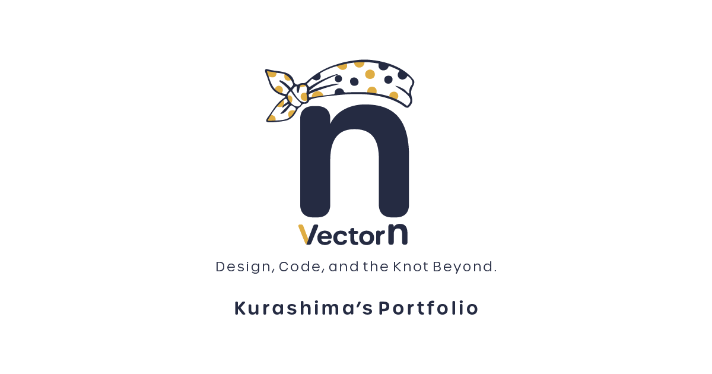

# VectorN — Portfolio

<div align="center">



**デザインと実装、その先にある「運用」までを設計する。**

見た目の美しさだけでなく、更新する人、使う人、育てていく人のことまで考える。

[](https://nextjs.org/)
[](https://www.typescriptlang.org/)
[](https://tailwindcss.com/)
[](https://www.framer.com/motion/)

</div>

---

## 📖 Concept — なぜこのデザインで、なぜこの技術を選んだのか

このプロジェクトは、離職期間中に「ただ動くものを作る」ことを目的とせず、**「なぜそれを選ぶのか」という意思決定のプロセス自体を鍛える場**として着手しました。

従来のWordPressサイトを、**Next.js（App Router）+ WordPress REST APIによるヘッドレスCMS構成へフルリプレイス**。技術選定、UI設計、アニメーション演出、SEO、メール配信基盤まで、全工程を一人で担うことで、フルスタックな開発視点を実地で習得しました。

---

## 🛠 Tech Stack

| カテゴリ        | 技術                      | 選定理由                                                                 |
| --------------- | ------------------------- | ------------------------------------------------------------------------ |
| **Framework**   | Next.js 15 (App Router)   | RSCによるデータフェッチの最適化、レンダリング戦略の柔軟な制御            |
| **Language**    | TypeScript                | 型安全による実装品質の担保と、WP REST APIレスポンスの型定義              |
| **Styling**     | Tailwind CSS v4           | ユーティリティファーストによる高速な実装と、デザイントークンの一元管理   |
| **Animation**   | Framer Motion             | Reactライフサイクルと親和性の高い宣言的アニメーション                    |
| **UI Library**  | shadcn/ui                 | アクセシブルなRadix UIプリミティブをベースにした柔軟なコンポーネント設計 |
| **CMS**         | WordPress REST API        | 既存コンテンツ資産の活用と、非エンジニアでも更新できる運用体制の維持     |
| **Opening**     | Lottie (lottie-react)     | After Effectsで制作したベクターアニメーションをWebへ忠実に移植           |
| **Mail**        | Resend                    | 独自ドメイン認証によるメール到達率の安定確保                             |
| **Analytics**   | GA4 (@next/third-parties) | パフォーマンスへの影響を最小化したサードパーティスクリプト管理           |
| **Infra (Dev)** | Docker                    | メモリ制限（4GB）によるローカル環境の安定化と再現性の確保                |

---

## 🎬 Key Features

### 1. GSAPからFramer Motionへ——技術的意思決定の記録

当初、スクロール連動アニメーションに **GSAP / ScrollTrigger** を採用していました。しかし実装が進む中で、以下の課題が顕在化しました。

- `useEffect` と `useGSAP` による**命令的な記述**が、コンポーネントの可読性を損なう
- Reactの仮想DOMとGSAPのDOM直接操作が競合し、**ページ遷移時に不整合**が発生
- アニメーションのステートとコンポーネントのステートが乖離し、**デバッグコストが増大**

これを受け、**主要なアニメーションをFramer Motionへ移行**することを決断。`motion` コンポーネント・`variants`による宣言的なアニメーション設計に刷新し、Reactのライフサイクルに沿った保守性の高い実装を実現しました。

```tsx
// Before (GSAP — 命令的)
useGSAP(() => {
  gsap.fromTo(ref.current, { opacity: 0 }, { opacity: 1, scrollTrigger: { ... } });
}, []);

// After (Framer Motion — 宣言的)
<motion.div
  initial={{ opacity: 0, y: 24 }}
  whileInView={{ opacity: 1, y: 0 }}
  transition={{ duration: 0.6, ease: 'easeOut' }}
  viewport={{ once: true }}
/>
```

---

### 2. After Effects → Lottie ——オープニングアニメーションの内製

サイト訪問者の第一印象を決定するオープニングアニメーションは、**After Effectsで制作したモーションをBodymovinでJSON書き出し**、`lottie-react`を通じてWebに実装しました。

GIFや動画ファイルと異なり、Lottieはベクターデータのためあらゆる解像度で鮮明に描画され、ファイルサイズも最小限に抑えられます。

---

### 3. 制作実績のパスワード保護機能

NDA案件など、公開に制限のある実績をポートフォリオとして提示するため、**shadcn/ui の Dialog コンポーネント**とWordPress REST APIを連携させたパスワード認証機能を実装しました。

- URLでの直接アクセスも認証で保護
- 認証済みコンテンツをクライアントサイドでセキュアに表示
- 採用担当者へ「合言葉」を伝えることでコミュニケーションのきっかけにもなる設計

---

### 4. Repository パターンによるAPI層の抽象化

WordPress REST APIへのアクセスを `worksRepository` に一元管理。ページ側は `worksRepository` だけを参照するため、将来的にHeadless CMSへ移行する場合も `repository.ts` の実装を差し替えるだけで対応できます。

```ts
// ページ側はAPIの実装を意識しない
const categories = await worksRepository.getAllCategories();
const works = await worksRepository.getWorksByCategory(slug);
```

---

## 🔍 SEO & Performance

- **動的サイトマップ**（`sitemap.ts`）: WordPress REST APIと連携し、実績の追加・削除に連動して自動生成
- **`robots.ts`**: クローラー制御とサイトマップURLの明示
- **OGP / Open Graph**: SNSシェア時の表示を完全にコントロール
- **画像最適化**: `next/image` の `sizes` 属性と `priority` を適切に設定し、LCPを改善
- **Google Analytics 4**: `@next/third-parties` を使用し、スクリプトのパフォーマンス影響を最小化

---

## 📁 Project Structure（抜粋）

```
.
├── app/
│   ├── works/
│   │   ├── page.tsx                  # 全カテゴリー一覧
│   │   └── [category]/
│   │       ├── page.tsx              # カテゴリー別実績一覧
│   │       └── [slug]/
│   │           └── page.tsx          # 実績詳細（パスワード保護対応）
│   ├── contact/
│   │   └── page.tsx                  # お問い合わせ（Resend連携）
│   └── actions/
│       └── sendEmail.ts              # Server Action（メール送信）
├── components/
│   ├── Breadcrumbs/                  # パンくずリスト（共通）
│   ├── works/
│   │   ├── WorkCard.tsx              # 実績カード（詳細ページへのリンク）
│   │   ├── CategoryCard.tsx          # カテゴリーカード（カテゴリーページへのリンク）
│   │   └── PageShell.tsx             # 下層ページ共通レイアウト
│   ├── top/
│   │   └── WorksSection.tsx          # トップページ Works カルーセル（Splide.js）
│   └── features/works/
│       ├── components/
│       │   └── WorkDetailContent.tsx # 実績詳細コンテンツ（パスワード保護含む）
│       └── api/
│           ├── types.ts              # 型定義（Category / WorkData / PageData）
│           └── repository.ts         # APIアクセスの窓口
├── public/
│   └── data/
│       └── data.json                 # After Effects製オープニングアニメーション
└── docker-compose.yml                # 開発環境（メモリ4GB制限）
```

---

## 🚀 Getting Started

```bash
# リポジトリのクローン
git clone https://github.com/shitsurae-lab/vector-n.git
cd vector-n

# 依存関係のインストール
npm install

# 環境変数の設定
cp .env.example .env.local
# .env.local を編集してください

# 開発サーバーの起動
npm run dev
```

### Docker を使う場合

```bash
docker compose up
```

### 環境変数

```env
NEXT_PUBLIC_WP_API_URL=your_wp_api_url
RESEND_API_KEY=your_resend_api_key
NEXT_PUBLIC_GA_MEASUREMENT_ID=G-XXXXXXXXXX
NEXT_PUBLIC_BASE_PATH=        # 開発中は /test、本番は空
```

---

## 🗺 Commit History — 開発の軌跡

| フェーズ           | 内容                                                      |
| ------------------ | --------------------------------------------------------- |
| **基盤構築**       | Next.js App Router + WP REST API の連携、動的ルーティング |
| **UI実装**         | shadcn/ui 導入、パスワード保護機能、レスポンシブ対応      |
| **アニメーション** | GSAP → Framer Motion への移行（宣言的UIへの転換）         |
| **API層の整理**    | repository パターン導入、types.ts による型定義の一元管理  |
| **Lottie導入**     | After Effects製アニメーションのWeb実装                    |
| **SEO強化**        | 動的サイトマップ、OGP、robots.ts                          |
| **メール基盤**     | Resend + Server Action によるお問い合わせフォームの実装   |

---

## 💭 振り返りと今後

このプロジェクトを通じて学んだことは、**「動けば正解ではない」** という感覚の養い方です。

GSAPからFramer Motionへの移行は、機能要件は満たしていたコードを、**保守性・可読性・Reactとの親和性**という観点で判断し直した経験でした。この「一度作ったものを疑い、より良い選択に乗り換える」プロセスこそが、実務で求められるエンジニアリングだと確信しています。

今後の展望として、ISR（Incremental Static Regeneration）によるパフォーマンスのさらなる改善と、E2Eテスト（Playwright）の導入を検討しています。

---

<div align="center">

**このREADMEを読んでくださった方へ**

技術のことでも、お仕事のことでも、お気軽にご連絡いただければ嬉しいです。

[Contact →](https://www.vector-n.net/contact)

</div>
